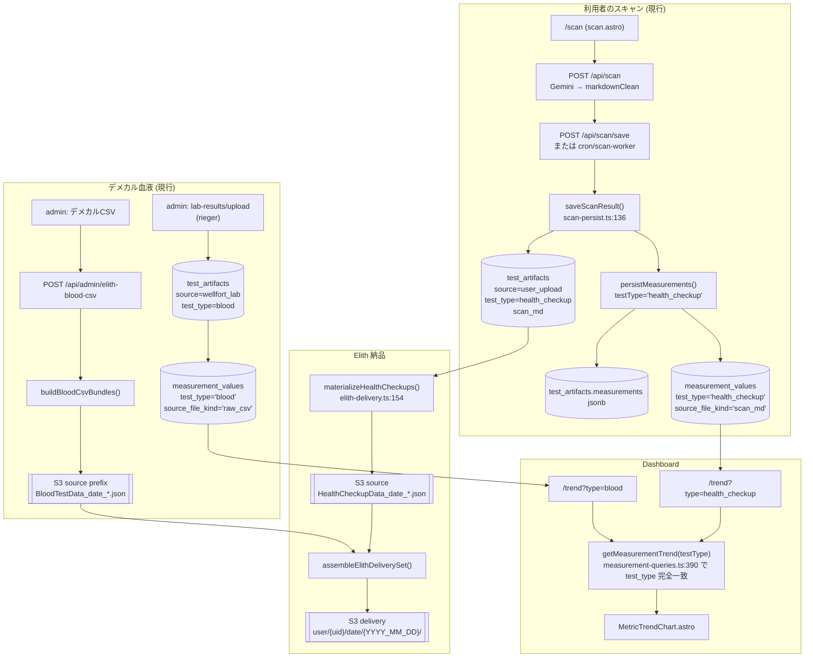
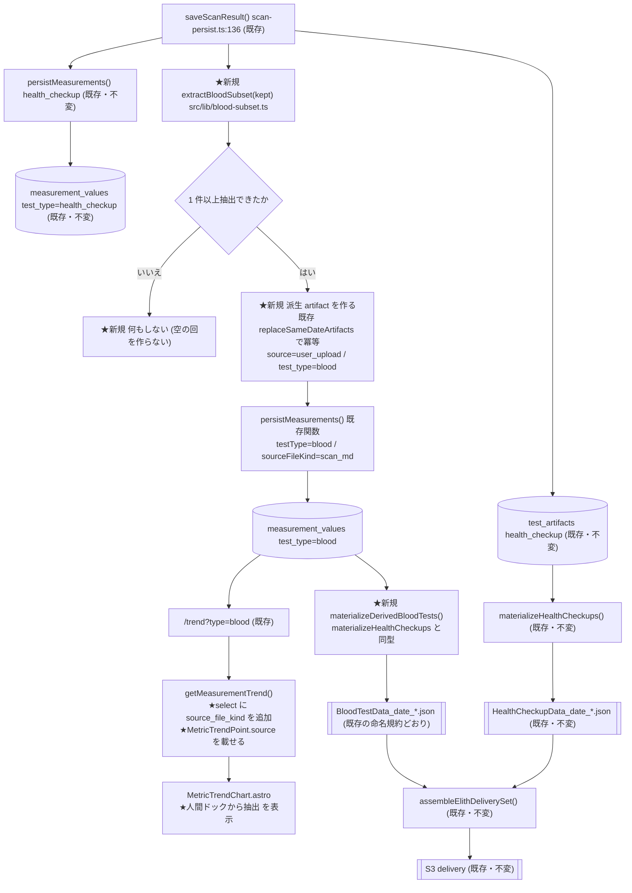

# 人間ドック・健康診断由来 血液検査データ連携 — 実装仕様書

| | |
|---|---|
| 文書 ID | `healthcheckup_blood_extraction_spec_20261001` |
| 作成日 | 2026-10-01 |
| 業務仕様の正 | Wellfort「人間ドック・健康診断由来 血液検査データ連携仕様書 v1.1 (2026-10-01)」(docx・発注者支給) |
| 調査基準 | `6abc310`（branch `claude/amazing-einstein-rd0fur` / repo `mirai-gpro/scan-chat-ai`） |
| 状態 | **仕様書のみ。実装は未着手**（発注者の実装開始指示待ち） |

> **この文書は `docs/specs/_TEMPLATE.md`（`WF-NNNN` 形式の Implementation Spec）ではない。**
> `scripts/spec-guard.mjs` は `docs/specs/WF-\d{4}\.md` だけを検証対象にするので、本ファイルの存在は
> 既存の検査を壊さない。先行する 2 本（`url_uid_privacy_spec_20260929.md` /
> `secure_shared_access_and_admin_impersonation_spec_20260930.md`）と同じ体裁。
>
> **本文の事実はすべて `6abc310` 時点の実コードで確認したもの**で、`file:line` を付けている。
> 確認できなかったものは本文中に **`要確認`** と書き、§14 に一覧でまとめた。
> **推測で仕様を決めた箇所は無い。**

---

## 1. 概要

### 1.1 目的

通常は年 3 回の血液検査（デメカル）に加えて、利用者がアプリでスキャンした
**人間ドック／健康診断の結果に含まれる血液検査値**を、**年間 4 回目の血液データポイント**として
Dashboard の時系列グラフと Elith 納品へ反映する。

### 1.2 背景（業務仕様 v1.1 の確定事項・再掲）

- 対象項目は **デメカルの検査項目に合わせた 15 項目**に固定する（v1.1 §4）。
- **15 項目が全部揃うことを条件にしない。** 項目数・領域数による成立判定は行わない（v1.1 §11 C3）。
- 欠損項目は **ブランク**。`0` にしない・推定しない・他項目から計算しない（v1.1 §6 / §12）。
- グラフは **値がある項目だけ**点を打つ。ブランクを 0 としてプロットしない（v1.1 §7）。
- 利用者画面では当該データポイントに **「人間ドックから抽出」** と表示する（v1.1 §11 C1）。
- **既存 AI スキャンの構造化結果を再利用し、同じ PDF を血液検査用に再解析しない**（v1.1 §3）。
- 元の `HealthCheckupData` は保持する。上書き・変換・削除しない（v1.1 §1.1 / §8）。
- `eGFR` は原本記載値のみ。クレアチニンから計算しない（v1.1 §5）。

### 1.3 対象範囲

| | |
|---|---|
| リポジトリ | **Scan-Chat-AI のみ**（Dashboard・スキャン保存・Elith 納品がすべてここに在る） |
| 入口 | 利用者のアプリ内スキャン（`/scan` → `POST /api/scan/save`、および背景ジョブ `GET /api/cron/scan-worker`） |
| 出口 | ① Dashboard の推移グラフ（`/trend?type=blood`） ② Elith 納品 `BloodTestData` |

### 1.4 対象外

- **wellfort-site の変更**。血液 CSV まわりの wellfort-site 側は Scan-Chat-AI API への**中継だけ**
  （`src/pages/api/admin/elith-blood-csv.ts:2`「本エンドポイントは中継のみ」）で、
  本件に関係する画面・処理を持たない。
- **admin バッチ経路**（`/api/admin/elith-scan` / `elith-hc-merge`）。こちらは既に
  `TEST_TYPE_BY_FORMAT`（`src/lib/scan-persist.ts:244-250`）で `formatId` を選べるため、
  `BloodTestData` を選べば血液の artifact を作れる。**今回の業務仕様は利用者のスキャンが対象**。
- **デメカル側の取り込み処理の変更**。
- **AI スキャンのプロンプト・読み取りロジックの変更**（v1.1 §12「再解析禁止」）。

---

## 2. 現行実装 調査結果

> ここに書いた名称・パス・関数名は**すべて実コードで確認した実在のもの**。
> 業務仕様 v1.1 §3 のフロー図の語（「HealthCheckupData」等）と実装の対応は §2.9 にまとめた。

### 2.1 人間ドック PDF のアップロード〜AI スキャン

| 段 | 実体 | 備考 |
|---|---|---|
| 画面 | `src/pages/scan.astro` | 撮影 / ファイル選択。複数ページ対応 |
| ページ束ね | `src/scripts/scan-pages.ts` | `ScanPage.origin` = `camera`／`file` |
| 送信 | `src/scripts/scan-upload.ts` / `src/lib/scan-upload-ticket.ts` | 予算超過は S3 直 PUT |
| 解析 API | `src/pages/api/scan.ts` | Gemini 呼び出し（`src/lib/gemini.ts`） |
| 背景ジョブ | `src/pages/api/scan/jobs.ts` → `GET /api/cron/scan-worker`（`vercel.json` crons `* * * * *`） | 全ページに S3 キーが揃った回だけ |
| 確定 Markdown | `src/lib/scan-markdown.ts`（`markdownClean`） | 推論値列を落とした 9 列 |

AI スキャンの出力は **Markdown の表**で、列は
`検査項目 / 検査項目詳細 / 読み取った値 / 単位 / 下限値 / 上限値 / 判定 / 備考`
（`src/lib/elith-export.ts:557-566` の `pickCol` が読む列名）。

### 2.2 構造化データの生成（Markdown → measurements）

`src/lib/elith-export.ts`

- `measurementsFromMarkdown(markdownClean)` (`:459-465`)
  = `parseScanRegions()` → `toMeasurements()` → `sanitizeMeasurementsForDelivery()`。
- `toMeasurements()` (`:552-`) が 1 行 = 1 measurement を作る。
  **納品 name は `pickDeliveryName(section, detail)` (`:537-551`)** が決める
  （「検査項目詳細」優先・汎用語なら「検査項目」・血圧だけ `最高血圧`/`最低血圧` へ正規化）。
- `sanitizeMeasurementsForDelivery(list)` (`:467-521`) が**唯一の納品整形本体**。
  返り値 `kept` の要素は `leanMeasurement()` (`:271-292`) が作る **7 フィールドだけ**:

  ```text
  { name, value, value_num, unit, ref_low, ref_high, flag }
  ```

  **`name_detail` / `note` / `category` / `assessment` はここで落ちる**（`:283-291`）。
  `flag` は `判定` 列の `H`/`L`、無ければ値中の `↑↓` から（`:277-282`）。
  **アプリが値と基準値を比較して判定することはしていない。**

### 2.3 HealthCheckupData（DB 保存）

`src/lib/scan-persist.ts` の `saveScanResult()` (`:136-241`)

```text
POST /api/scan/save (src/pages/api/scan/save.ts:90)
  または GET /api/cron/scan-worker (src/pages/api/cron/scan-worker.ts:151)
      ↓ saveScanResult()
      ① 受診日 = examDate → extractExamDate(md) → JST today      (scan-persist.ts:152-156)
      ② requireReadableDate ガード (スペシャルのみ)              (:164)
      ③ measurementsFromMarkdown(md).kept                        (:168)
      ④ extractAgeSex(md) → age_at_test / sex                    (:177)
      ⑤ replaceSameDateArtifacts(uid, 'health_checkup', date, 'user_upload')  (:186)
      ⑥ insert diagnosis.test_artifacts
           source='user_upload' / test_type='health_checkup'      (:197-199)
           scan_md = markdownClean                                (:207)
      ⑦ persistMeasurements(... testType:'health_checkup', sourceFileKind:'scan_md')  (:227-234)
```

`persistMeasurements()`（`src/lib/measurement-persist.ts:106-168`）が**検査値の唯一の書き込み口**で、
2 層に同時に書く:

| 層 | 実体 | 内容 |
|---|---|---|
| ① 原本忠実 | `diagnosis.test_artifacts.measurements` (jsonb) | `lean` 配列そのまま (`:107-112`) |
| ② 正規化 | `diagnosis.measurement_values` | グラフ用。1 行 = 1 項目 (`:123-157`) |

`measurement_values` の列（`supabase/migrations/20260820000010_measurement_values.sql:28-66`）:

```text
artifact_id / diagnostic_user_id / test_type / test_date / seq
item_name / canonical_name
value / value_num / unit / ref_low / ref_high / ref_low_num / ref_high_num
flag / assessment / source_file_kind / created_at
unique (artifact_id, seq)
```

**`test_type` は artifact の値のコピー**（`measurement-persist.ts:132` が `input.testType` をそのまま入れる）。
**`canonical_name` は `standard-master.findByAlias()` が完全一致したときだけ**（`:125-128`）。
**`source_file_kind` が「由来」を持つ唯一の列**（スキャン=`'scan_md'` / 血液CSV=`'raw_csv'`）。

### 2.4 デメカル血液検査（BloodTestData）

`src/lib/elith-blood-csv.ts`

- CSV は**自己記述型**。ヘッダの `項目名N` セルに標準名、データ行に略号（`:68-78` `headerStdName`）。
  実例（`scripts/blood-csv-fixtures/demecal_sample_v1.csv`）:
  ヘッダ `総タンパク` / `HbA1c(NGSP)` / `LDLコレステロール` / `AST(GOT)` ←→ 行 `TP` / `HbA1c` / `LDL-C` / `AST`。
- `buildRowMeasurements()` (`:207-280`) が `ElithMeasurement` を作る。
  **CSV は単位列も基準値列も持たない**ので、`unit` / `ref_low` / `ref_high` / `flag` は
  **初期値 null** (`:262-266`) で、`applyBloodReference()` が埋める設計。
- **`BLOOD_REFERENCE` は空の `{}`**（`src/lib/blood-reference-master.ts:33-36`・登録 0 件）。
  → **現状、デメカル由来の血液検査値には単位も基準値も H/L 判定も 1 件も入っていない。**
- `buildBloodCsvBundles()` (`:298-412`) が `BloodTestDataJson` (`:142-163`) を作り、
  キー `{prefix}user/{clientId}/date/{YYYY_MM_DD}/BloodTestData_date_{YYYY_MM_DD}_user_{clientId}.json` (`:361-363`)。
- 入口 API = `src/pages/api/admin/elith-blood-csv.ts`（admin 画面からの手動取り込み）。
  **このルートは S3 へ書くだけで、DB には 1 行も書かない。**
- 本番用の純粋パーサ `parseBloodCsvRowsStrict()` (`:494-`) は実装済みだが、
  **API から 1 か所も呼ばれていない**（呼んでいるのは `scripts/verify-blood-parser.ts` だけ）。

### 2.5 `test_type='blood'` の artifact を作る経路（実測）

`diagnosis.test_artifacts` に `test_type='blood'` を insert するコードは **2 か所だけ**。

| # | 場所 | source | 測定値 |
|---|---|---|---|
| 1 | `src/pages/api/admin/lab-results/upload.ts:102-115` (`rieger` → `'blood'`・`:20`) | `wellfort_lab` | CSV 1 人分のときだけ `persistMeasurements`（`:154-161`） |
| 2 | `src/pages/api/admin/lab-results/register.ts:179-191` | `wellfort_lab` | （原本ファイルの後付け登録） |

加えて `src/pages/api/admin/elith-scan.ts:220` が `TEST_TYPE_BY_FORMAT[formatId]` で種別を決めるので、
admin が `formatId='BloodTestData'` を選べば `source='admin_batch'` の血液 artifact を作れる
（`persistAdminBatchArtifact` `src/lib/scan-persist.ts:279-355`）。

→ **利用者のスキャン経路から血液 artifact を作るコードは存在しない。**

### 2.6 Dashboard（検査カード・推移グラフ）

```text
src/pages/dashboard.astro:374
  → TestResultsSection.astro
      TEST_TYPES (:58-64) = health_checkup / blood / cancer_urine / ai_prediction / genetics
      mine  = artifacts.filter(a => a.test_type === t.type)   (:92)
      canGraph = t.trend && mine.length >= 2                   (:100)   ← ★ artifact 件数で決まる
      「グラフ」→ /trend?type=<test_type>

src/pages/trend.astro
  :70  getTrendCandidates(resultUid, type)
  :83  getMeasurementTrend(resultUid, candidates, 12, type)
  → MetricTrendChart.astro (series)
```

`src/lib/measurement-queries.ts`

- `activeArtifactIds()` (`:156-174`) … `test_artifacts.status='active'` の id を先に引く。
- `getMeasurementTrend()` (`:357-449`)
  - `measurement_values` を `diagnostic_user_id` + `in('artifact_id', active)` +
    `.not('value_num','is',null)` で引く (`:341-358`)。
    **select 列に `source_file_kind` は入っていない**（実測 `grep -c source_file_kind src/lib/measurement-queries.ts` = 0）。
  - **`const typed = testType ? all.filter(r => r.test_type === testType) : all;` (`:390`)**
    ← ★ 絞り込みは `measurement_values.test_type`（artifact の種別ではない）。
  - 系列キーは `seriesKey()` (`:313-319`) = `canonical_name`、無ければ `item_name`
    （テストフェーズの暫定措置・同ファイルのコメント `:268-283`）。
  - `value_num` が null の行は点にしない (`:428`) → **欠損は自動的に「点を打たない」**。
- `getTrendCandidates()` (`:289-355`) … **日付の違う点が 2 つ以上ある項目だけ**を候補にする (`:332`)。
- `DEFAULT_TREND_ITEMS` (`:93-100`) = `HbA1c(NGSP)` / `空腹時血糖` / `LDLコレステロール` / `γ-GTP` / `尿酸` / `eGFR`。

型（`src/lib/dashboard-queries.ts:26-43`）:

```ts
interface MetricTrendPoint { date: string; value: number; raw: string; flag?: 'H'|'L'|null }
interface MetricTrendSeries { label: string; unit: string; referenceUpper?: number; referenceLower?: number; points: MetricTrendPoint[] }
```

**`MetricTrendPoint` に「出所」を表すフィールドは無い。**

`MetricTrendChart.astro` の描画面:

| 面 | 行 | 内容 |
|---|---|---|
| ミニカード | `:115-181` | 最新値 + スパークライン + 期間 |
| 拡大モーダル | `:196-283` | 大きい折れ線 + 各点の値ラベル |
| 測定履歴テーブル | `:287-319` | **検査日 / 値 / 前回比 / 判定** の 4 列 |

### 2.7 Elith 納品

```text
① source prefix (S3) へ format 別 JSON を置く
     HealthCheckupData … src/lib/elith-delivery.ts:154-237 materializeHealthCheckups()
       - diagnosis.test_artifacts から test_type='health_checkup' / status='active' を全件 (:162-171)
       - scan_md → measurementsFromMarkdown().kept (:184)
       - キー {prefix}user/{uid}/date/{YYYY_MM_DD}/HealthCheckupData_date_..._user_{uid}.json (:214)
     BloodTestData     … src/lib/elith-blood-csv.ts:361-363 (admin の CSV 取り込みのみ)
     Lifestyle…        … src/lib/interview-export.ts

② 納品セットの組み立て
     src/lib/elith-assemble.ts assembleElithDeliverySet() (:371-551)
       - inventoryElithSource() が source prefix を走査しキー名から format/date/client を復元 (:48-60, :107-)
       - SERIES_FORMATS = ['BloodTestData','CancerRiskAssessmentData','HealthCheckupData','Other'] (:392)
         → この 4 つは **client 単位で全 date を丸ごと**納品する (:483-497)
       - 納品キー {deliveryPrefix}user/{uid}/date/{bd}/{format}_date_{bd}_user_{uid}.json (:496)
       - manualMapping 指定時は **mapping に載っている format だけ** picks に入る (:400-411)

③ 発火
     手動  POST /api/admin/special-accounts/deliver
     自動  GET /api/cron/elith-deliver（vercel.json `0 14 * * *` = 23:00 JST）
             deliveryPrefix='' / sourcePrefix=cfg.prefix (src/pages/api/cron/elith-deliver.ts:56-61)
             skipDelivered:true → diagnosis.elith_deliveries で冪等
             (unique (diagnostic_user_id, bundle_date, delivery_prefix)・20260924000010:41)

④ 揃い判定
     src/lib/elith-entitlement.ts
       FORMAT_SOURCE (:49-57): BloodTestData → { testType: 'blood' }
       checkFormatsReady() (:158-) が test_artifacts(status='active') の **有無だけ**を見る (:189-198)
```

`deliverReadySpecialAccounts()`（`src/lib/elith-delivery.ts:424-`）が組み立てる `manualMapping` は
**`HealthCheckupData` と `LifestyleQuestionnaireData` の 2 つだけ**（`:545-551`）。

### 2.8 S3

`src/lib/s3.ts`。バケット `AWS_S3_BUCKET`（既定 `wellfort-ai-input`）、prefix `AWS_S3_PREFIX`。
納品パス規約は `docs/elith/elith_s3_data_handoff_spec.md` §3（`/{prefix}user/{client_id}/date/{YYYY_MM_DD}/`）
および `{format_id}_date_{YYYY_MM_DD}_user_{client_id}.json`。

### 2.9 業務仕様 v1.1 の語と実装名の対応

| v1.1 §3 の語 | 実装での正しい名前 |
|---|---|
| PDF アップロード | `src/pages/scan.astro` + `src/scripts/scan-upload.ts` |
| 既存 AI スキャン | `POST /api/scan` → `src/lib/gemini.ts` → `markdownClean` |
| HealthCheckupData（生成） | `diagnosis.test_artifacts`(`test_type='health_checkup'`, `scan_md`) + `measurements`(jsonb) + `diagnosis.measurement_values` |
| HealthCheckupData（Elith 納品 JSON） | `materializeHealthCheckups()` が S3 に書く `HealthCheckupData_date_*.json` |
| 対象項目抽出 | **未実装（今回作る）** |
| BloodTestData 生成 | 既存は `elith-blood-csv.ts` のみ（デメカル CSV 専用） |
| Dashboard 反映 | `/trend?type=blood` → `getMeasurementTrend(..., 'blood')` |
| Elith 納品 | `assembleElithDeliverySet()` の `SERIES_FORMATS` 経由 |

---

## 3. 現行データフロー



**現行の帰結（実測）**

1. 人間ドックの血液値は `measurement_values` に `test_type='health_checkup'` で入っている。
2. `/trend?type=blood` は `test_type='blood'` の行しか見ない（`measurement-queries.ts:390`）ので、
   **人間ドックの血液値はいま血液グラフに一切出ていない。**
3. 利用者のスキャンからは `BloodTestData` JSON が 1 件も作られない。

---

## 4. 変更後データフロー（方針案）

> **`★` が付いたものが新規。** それ以外は既存処理の再利用（1 行も変えないもの＝「既存・不変」）。



### 4.1 既存のまま再利用できるもの（変更しない）

| 再利用するもの | 場所 | 理由 |
|---|---|---|
| AI スキャン一式 | `api/scan.ts` / `gemini.ts` / `scan-markdown.ts` | **再解析しない**（v1.1 §3）。`markdownClean` をそのまま材料にする |
| 納品整形 | `sanitizeMeasurementsForDelivery()` `elith-export.ts:467` | 整形を二重管理しない（CLAUDE.md） |
| 名寄せ | `standard-master.findByAlias()` `standard-master.ts:139-142` | **完全一致のみ**。独自の同義語ロジックを新設しない |
| 検査値の書き込み | `persistMeasurements()` `measurement-persist.ts:106` | 「唯一の書き込み口」。`testType` は既に引数（`:132`） |
| 同日回の片付け | `replaceSameDateArtifacts()` `scan-persist.ts:81-130` | 冪等性を独自に作らない |
| グラフ | `getMeasurementTrend()` / `MetricTrendChart.astro` | 既存の系列・欠損の扱いがそのまま要件を満たす |
| Elith の組み立て | `assembleElithDeliverySet()` | `BloodTestData` は既に `SERIES_FORMATS`（`elith-assemble.ts:392`）。**新形式を作らない** |
| 納品の冪等 | `diagnosis.elith_deliveries` | 既存 |

### 4.2 新規に要るもの

| # | 内容 | 想定の置き場所 |
|---|---|---|
| N-1 | 15 項目の対象マスタ + 抽出関数（lean measurements → 血液サブセット） | **新規** `src/lib/blood-subset.ts` |
| N-2 | 派生 `test_type='blood'` artifact の生成（`saveScanResult` から呼ぶ） | `src/lib/scan-persist.ts`（既存関数の後段） |
| N-3 | `measurement_values` の `source_file_kind` をグラフまで運ぶ | `src/lib/measurement-queries.ts` / `src/lib/dashboard-queries.ts`（型） |
| N-4 | 「人間ドックから抽出」の表示 | `src/components/dashboard/MetricTrendChart.astro` |
| N-5 | 派生 `BloodTestData` の S3 出力 | `src/lib/elith-delivery.ts`（`materializeHealthCheckups` と同型の関数） |
| N-6 | 回帰チェック `npm run verify:blood-subset` | `scripts/verify-blood-subset.ts` + `package.json` |

---

## 5. 対象 15 項目 マッピング

### 5.1 突合表

- **既存内部名称** = `src/lib/standard-master.ts` の `canonical_name`（`findByAlias` の戻り）。
  本表の値は `findByAlias()` を**実際に実行して得た実測値**（§5.2 の再現コマンド）。
- **JSON key** = `BloodTestData.data.measurements[].name`
  （`docs/elith/elith_s3_data_handoff_spec.md` §7.1 / `elith-blood-csv.ts:259-266`）。
- **DB field** = `diagnosis.measurement_values.item_name` / `.canonical_name`。
- **デメカル表記** = デメカル CSV ヘッダの標準名。fixture で実在が確認できたものだけ記載し、
  残りは `要確認`（§14 Q-1）。

| # | 業務名称 (v1.1 §4) | 既存内部名称 (`canonical_name`) | デメカル CSV ヘッダ標準名 | 既存同義語処理（`findByAlias` が当たる表記） | 単位 (`standard-master`) | 備考 |
|---|---|---|---|---|---|---|
| 1 | AST（GOT） | `GOT(AST)` | `AST(GOT)` (fixture 実在) | AST / GOT / AST(GOT) / GOT(AST) | `U/L` | |
| 2 | ALT（GPT） | `GPT(ALT)` | `要確認` | ALT / GPT / ALT(GPT) / GPT(ALT) | `U/L` | |
| 3 | γ-GTP | `γ-GTP` | `要確認` | γ-GTP / γGTP / GGT / Y-GTP / YGTP / ガンマGTP | `U/L` | **`γ-GT` は当たらない**（実測 NULL） |
| 4 | 総蛋白（TP） | `総蛋白` | `総タンパク` (fixture 実在) | TP / 総蛋白 / 総タンパク / 血清総蛋白 | `g/dL` | |
| 5 | アルブミン（Alb） | **なし（NULL）** | `要確認` | **当たらない** | — | **標準マスタ未収録**（§6.3 / Q-2） |
| 6 | LDLコレステロール | `LDLコレステロール` | `LDLコレステロール` (fixture 実在) | LDL / LDL-C / LDLコレステロール | `mg/dL` | `LDLコレステロール(F式)` は**別項目**として収録済 |
| 7 | HDLコレステロール | `HDLコレステロール` | `要確認` | HDL / HDL-C / HDLコレステロール | `mg/dL` | |
| 8 | 総コレステロール | `総コレステロール` | `要確認` | TC / T-Cho / 総コレステロール | `mg/dL` | v1.1「人間ドックに無ければブランク」 |
| 9 | 中性脂肪（TG） | **`空腹時中性脂肪` / `随時中性脂肪` の 2 本に分かれる** | `要確認` | 無修飾の `TG` / `中性脂肪` / `トリグリセライド` / `中性脂肪(TG)` は**当たらない** | `mg/dL` | **最大の論点。§6.4 / Q-3** |
| 10 | 空腹時血糖 | `空腹時血糖` | `要確認` | 空腹時血糖 / 空腹時血糖(FBS) / FBS | `mg/dL` | `血糖` / `随時血糖` は**当たらない**（仕様どおり） |
| 11 | HbA1c | `HbA1c(NGSP)` | `HbA1c(NGSP)` (fixture 実在) | HbA1c / HbA1c(NGSP) / ヘモグロビンA1c | `%` | |
| 12 | クレアチニン | `クレアチニン` | `要確認` | Cr / CRE / クレアチニン / クレアチニン(血清) | `mg/dL` | |
| 13 | eGFR | `eGFR` | `要確認` | eGFR / 推算GFR / eGFRcreat | `mL/min` | **`e-GFR` は当たらない**（実測 NULL・§6.3） |
| 14 | 尿酸（UA） | `尿酸` | `要確認` | UA / 尿酸 / 尿酸値 / 痛風 | `mg/dL` | |
| 15 | 尿素窒素（BUN） | **なし（NULL）** | `要確認` | **当たらない** | — | **標準マスタ未収録**（§6.3 / Q-2） |

### 5.2 再現コマンド（この表の根拠）

```bash
# 15 項目と表記ゆれを findByAlias に通して canonical_name を印字する
cd /path/to/Scan-Chat-AI
cat > /tmp/probe.ts <<'EOF'
import { findByAlias, normKey } from './src/lib/standard-master';
for (const n of ['AST','GOT','AST(GOT)','ALT','GPT','γ-GTP','GGT','γ-GT','TP','総蛋白',
  'Alb','アルブミン','LDL','HDL','TC','TG','中性脂肪','中性脂肪(TG)','空腹時中性脂肪',
  '随時中性脂肪','空腹時血糖','血糖','随時血糖','HbA1c','Cr','eGFR','e-GFR','UA','BUN','尿素窒素'])
  console.log(n, '->', findByAlias(n)?.canonical_name ?? 'NULL', `(normKey=${normKey(n)})`);
EOF
npx esbuild /tmp/probe.ts --bundle --platform=node --format=esm --log-level=error | node --input-type=module
```

### 5.3 人間ドック原本での実際の表記（ゴールデン実測）

| 項目 | `docs/scan/golden/scan_golden_humandock_20250217.md` | `…_humandock_20240924.md` | `…_healthcheckup_20250123.md` |
|---|---|---|---|
| 中性脂肪 | `随時中性脂肪` 221（空腹時TGは空） `:62,:100` | `中性脂肪(TG)` 129 `:85` | `空腹時中性脂肪` 54 `:52` |
| 血糖 | `随時血糖` 79（空腹時血糖は空） `:64,:103` | `空腹時血糖` 101 `:86` | `空腹時血糖` 104 `:53` |
| eGFR | `eGFR` 64.6（alt に `e-GFR` `:106`） | `eGFR` 72 `:88` | `eGFR` 56.9 `:56` |
| アルブミン | `アルブミン` 4.4 `:92` | `アルブミン` 3.9 `:80` | 今回=空 `:55` |
| 尿素窒素 | `尿素窒素` 18.1（alt `UN`/`BUN`） `:106` | `尿素窒素` 10.7 `:88` | 今回=空（BUN） `:56` |
| 総コレステロール | 251 `:98` | 151 `:82` | 196 `:52` |

→ **3 検体とも「中性脂肪」と「血糖」の修飾語が違う。** 実在する様式の揺れであって例外ではない。

---

## 6. 欠損値仕様

### 6.1 各層が使っている欠損の表し方（実測）

| 層 | 欠損の表し方 | 根拠 |
|---|---|---|
| **抽出段** | **その measurement を `kept` に入れない**（行ごと落とす） | `elith-export.ts:489`「`value == null && value_num == null` は納品しない」 |
| **DB `measurements` (jsonb)** | **配列に要素が無い**（null も空文字も入れない） | `measurement-persist.ts:107-112` が `kept` をそのまま入れる |
| **DB `measurement_values`** | **行が存在しない** | `:123-157` が `kept` の要素ぶんだけ insert |
| **Dashboard グラフ** | **その項目の点が無い**（`value_num` が null の点は打たない） | `measurement-queries.ts:428` |
| **Dashboard 履歴テーブル** | 前回比・判定が無い欄は **`—`**（全角ダッシュ） | `MetricTrendChart.astro:304,313` |
| **Elith JSON** | `data.measurements[]` に**その要素が無い** | `elith-delivery.ts:184` が `kept` を入れる |
| **（参考）値はあるが単位/基準値が無い** | `unit` / `ref_low` / `ref_high` は **`null`**（キーは出す） | `leanMeasurement()` `elith-export.ts:283-291` |

**→ 今回の「ブランク」は、既存のどの層でも「行・要素ごと出さない」で表現する。**
`null` を入れた空行も、空文字も、`0` も作らない。**今回だけの独自表現は追加しない。**

### 6.2 「15 項目が揃わなくても有効」の実装上の意味

業務仕様 v1.1 §11 C3 の「成立判定を行わない」は、実装では

- **項目数の閾値を書かない**（`if (count >= N)` を作らない）。
- **領域の判定を書かない**（肝/脂質/糖/腎 の数を数えない）。

と読む。ただし **1 件も抽出できなかった回**は、派生 artifact を作ると
`data.measurements` が空の `BloodTestData` を Elith に渡すことになる。
既存の `materializeHealthCheckups()` は同じ場面で
`if (measurements.length === 0) continue;`（`elith-delivery.ts:185`）と**作らない**方を選んでいる。
→ **0 件のときだけ作らない**を既存規律に合わせて採る。これは「成立判定」ではなく
「空のファイルを納品しない」という既存ルールの適用。**`要確認` Q-6 として発注者確認に出す。**

### 6.3 標準マスタ未収録項目の扱い（アルブミン / 尿素窒素 / `e-GFR`）

`findByAlias()` は**正規化した完全一致のみ**（`standard-master.ts:18-20` の安全設計）。
`normKey()`（`:49-55`）は NFKC・小文字化・`空白 / 　 / ・ / （） / ()` の除去だけで、
**ハイフンは消さない**。したがって:

- `アルブミン` / `Alb` → `canonical_name = null`（実測）
- `尿素窒素` / `BUN` / `UN` → `canonical_name = null`（実測）
- `e-GFR` → `normKey='e-gfr'` ≠ `'egfr'` → `null`（実測）

`canonical_name` が null でも、`seriesKey()`（`measurement-queries.ts:313-319`）が
**`item_name` にフォールバックする**ので**グラフには出る**。ただし
「表記が揺れたら別系列に割れる」という既知のリスク（同ファイル `:268-283` のコメント）を負う。

→ **恒久策は `STANDARD_MASTER` に 3 件（アルブミン / 尿素窒素 / `e-GFR` 別名）を追加すること。**
ただし `STANDARD_MASTER` は「**代表ゴールデン検体に実在する標準項目だけ**を収録する」
という明文の規律を持つ（`standard-master.ts:9-11`）。アルブミンと尿素窒素は
`scan_golden_humandock_20240924.md:80,:88` / `…_20250217.md:92,:106` に実在するので
この規律に反しない。**`e-GFR` も `…_20250217.md:106` の alt に実在する。**
→ **追加してよいが、発注者判断事項として §14 Q-2 に出す。**

### 6.4 中性脂肪（最大の論点）

`STANDARD_MASTER` は **無修飾の `TG` / `中性脂肪` を意図的に登録していない**
（`standard-master.ts:82`「空腹時/随時 は別項目として区別。ambiguous な『中性脂肪』単独は登録しない」）。
これは業務仕様 v1.1 §5「『血糖』とだけ記載され、空腹時血糖と確認できない値は
空腹時血糖へ推測マッピングしない」と**同じ思想**である。

一方 v1.1 §4 の 15 項目は「中性脂肪 / TG / 中性脂肪 / トリグリセライド」を**1 項目**として扱う。

実在する 3 検体で表記が 3 通り（`随時中性脂肪` / `中性脂肪(TG)` / `空腹時中性脂肪`）に割れているため、
**この 3 つを 1 系列にまとめるか、別系列のままにするかで、グラフの線の本数が変わる。**
まとめるなら「空腹時 TG と随時 TG を同じ線に乗せる」ことになり、これは**検査値の意味を変える解釈**で、
CLAUDE.md の「アプリは独自に分析・解釈しない」に触れる。

→ **こちらで決めない。§14 Q-3 として発注者・Wellfort へ確認に出す。**
（デメカルが「中性脂肪」をどの修飾で出しているかが分かれば自動的に決まる＝Q-1 と連動。）

---

## 7. Dashboard 仕様

### 7.1 データの流れ（変更後）

```text
/dashboard
  TestResultsSection.astro:92   artifacts.filter(test_type==='blood')
  TestResultsSection.astro:100  canGraph = mine.length >= 2     ← 派生 artifact も数に入る
  → /trend?type=blood
      trend.astro:70  getTrendCandidates(uid, 'blood')
      trend.astro:83  getMeasurementTrend(uid, candidates, 12, 'blood')
         measurement-queries.ts:390  r.test_type === 'blood' で絞る
      → MetricTrendChart.astro
```

### 7.2 日付軸 / 同一項目の統合 / 通常検査との混在

| 論点 | 現行の挙動 | 今回 |
|---|---|---|
| 日付軸 | `test_date`（`measurement_values.test_date`）の昇順。`maxPoints=12` で末尾から切る（`measurement-queries.ts:425-428`） | **変更なし**。人間ドックの受診日がそのまま 4 点目になる |
| 同一項目の統合 | `seriesKey()` = `canonical_name` ∥ `item_name`（`:313-319`） | **変更なし**。デメカル側と同じ `canonical_name` が付けば自動的に同じ線に乗る |
| 通常検査との混在 | `test_type='blood'` の行はすべて同じ系列に入る | **変更なし**（派生行も `test_type='blood'` にするため） |
| 欠損値 | `value_num` が null の行は点にしない（`:428`）。行が無ければそもそも来ない | **変更なし** = 要件どおり |
| 基準線 | **系列の最後の行**の `ref_low_num` / `ref_high_num` を使う（`:441-442`） | §7.5 に注意点 |

### 7.3 「人間ドックから抽出」の表示

**既存の `MetricTrendPoint` に出所のフィールドが無い**（`dashboard-queries.ts:26-33`）ので、
点ごとの出所を運ぶ経路を 1 本足す。**DB 変更は不要**（`source_file_kind` が既に在る）。

```text
measurement_values.source_file_kind  ('scan_md' | 'raw_csv' | null)   ← 既存列
  ↓ measurement-queries.ts: select に source_file_kind を追加（Row 型にも追加）
  ↓ MetricTrendPoint に source?: 'health_checkup_scan' | null を追加
  ↓ MetricTrendChart.astro が表示
```

**表示箇所（提案）**

| 面 | 出すか | 内容 |
|---|---|---|
| 測定履歴テーブル（`MetricTrendChart.astro:287-319`） | **出す** | 「検査日」セルの下に小さく `人間ドックから抽出` |
| 拡大モーダルの折れ線（`:241-285`） | **出さない** | 点の近傍に文字を足すと値ラベルと重なる（`:276-283` に既に値と日付が出ている） |
| ミニカード（`:115-181`） | **最新点が人間ドック由来のときだけ出す** | 最新値のすぐ下 |
| 検査カード（`TestResultsSection.astro`） | **出さない** | カードは種別単位で、点単位の出所を持たない |

**文言は「人間ドックから抽出」で固定**（v1.1 §11 C1 の確定文言）。
健康診断（健診）由来も `test_type='health_checkup'` で区別が付かないため同じ文言になる → **`要確認` Q-7**。

### 7.4 mobile 表示への影響

- 測定履歴テーブルは `.md-region table` ではなく `MetricTrendChart.astro:288` の素の `<table class="w-full">`。
  **列を増やすと 390px で潰れる**（CLAUDE.md「`.md-region table` に `w-full` を当てない」の同型事例）。
  → **列は増やさず、「検査日」セル内に 2 行目として置く。**
- ミニカードは `:127` の `text-2xl` の直下に `text-xs`（**12px 以下を作らない**＝CLAUDE.md 禁止事項に抵触しない
  13px 相当の `text-sm` を使う）。
- 実測確認は `npm run verify:screen` の系統で行う（390 / 768 / 1280）。

### 7.5 既知の注意（基準線）

`getMeasurementTrend()` は**系列の最後の行**から `referenceUpper` / `referenceLower` を取る（`:441-442`）。
デメカル由来の行は `ref_*` が**全部 null**（§2.4・`BLOOD_REFERENCE` 空）なので、
**人間ドック由来の点が最新になった回だけ、グラフに突然 基準帯が現れる**ことになる。

値は原本どおりで捏造ではないが、**回によって基準線が出たり消えたりする**という
利用者から見た不連続が生じる。**こちらで決めない → §14 Q-5。**

---

## 8. Elith 連携仕様

### 8.1 既存を確認した結果

| 確認項目 | 実測 |
|---|---|
| 既存 JSON | `docs/elith/elith_s3_data_handoff_spec.md` §7.1 の検査値型（`measurements[]`） |
| BloodTestData の生成 | `elith-blood-csv.ts:338-357`（デメカル CSV 専用）。`kind:'lab_csv'` |
| format_id | `BloodTestData`（`elith-export.ts:40-46` の `ELITH_FORMAT_IDS` に収録済） |
| S3 path | `{prefix}user/{client_id}/date/{YYYY_MM_DD}/` |
| ファイル名 | `BloodTestData_date_{YYYY_MM_DD}_user_{client_id}.json` |
| 検査日 | JSON 本文 `test_date`。フォルダ日付は `date_source` 付き（`elith-blood-csv.ts:148-149`） |
| client_id | `diagnostic_user_id`（`elith-delivery.ts` では remap が恒等・同ファイル `:9-13`） |
| delivery 対象判定 | `checkFormatsReady()`（`elith-entitlement.ts:158-`）が `test_artifacts(status='active')` の有無を見る |
| retry / 冪等 | `diagnosis.elith_deliveries` の `unique (diagnostic_user_id, bundle_date, delivery_prefix)` + `skipDelivered`（`elith-delivery.ts:499`） |

### 8.2 合流位置（最も安全な場所）

**`src/lib/elith-delivery.ts` の `materializeHealthCheckups()` と同じ段**に、
同型の `materializeDerivedBloodTests(uid, sourcePrefix)` を置く。

理由:

1. **その段より下は 1 行も変えずに済む。** `assembleElithDeliverySet()` は
   source prefix を**キー名で走査**する（`elith-assemble.ts:107-128` の `inventoryElithSource`）だけなので、
   規約どおりのキーで JSON を置けば**自動的に納品対象になる**。
2. `BloodTestData` は既に `SERIES_FORMATS`（`elith-assemble.ts:392`）なので、
   **複数回ぶんが date フォルダごとに丸ごと納品される**＝時系列の扱いも既存のまま。
3. `materializeHealthCheckups()` と同じく **DB（`measurement_values` / `scan_md`）から決定論生成**するので、
   再解析が起きない（v1.1 §3）。
4. 失敗したら**その年を飛ばす**という既存の fail-safe（`elith-delivery.ts:221`）をそのまま使える。

**ただし 1 行だけ既存の変更が要る**: `deliverReadySpecialAccounts()` が組む `manualMapping` は
現在 `HealthCheckupData` と `LifestyleQuestionnaireData` だけ（`elith-delivery.ts:545-551`）。
`manualMapping` 指定時は **mapping に載っている format しか picks に入らない**（`elith-assemble.ts:400-411`）ので、
**`BloodTestData` のキーを mapping に足す**必要がある。

### 8.3 生成する JSON の形

`materializeHealthCheckups()` が作る HealthCheckupData（`elith-delivery.ts:196-215`）と同じ骨格で、
変えるのは次だけ:

```jsonc
{
  "format_id": "BloodTestData",          // ← HealthCheckupData から変更
  "schema_version": "<ELITH_HANDOFF_SCHEMA_VERSION>",
  "kind": "scan",                        // 既存 HC と同じ（CSV 経路は 'lab_csv'）
  "client_id": "<uid>",
  "diagnostic_id": "<uid>",
  "source_image": null,
  "test_date": "<人間ドックの受診日>",
  "date_source": "test_artifacts",
  "exported_at": "...",
  "subject": { "sex": null, "age": null },
  "source": {
    "origin": "scan-chat-ai",
    "app": "scan-chat-ai",
    "note": "人間ドック/健康診断スキャンから対象15項目を抽出した派生データ",   // ← 要確認 Q-8
    "lab_name": null
  },
  "data": { "measurements": [ /* 抽出できた項目だけ */ ], "notes": [] }
  // raw_markdown は載せない（§8.4）
}
```

**`measurements[]` の要素は `leanMeasurement` の 7 フィールド**（`name / value / value_num / unit /
ref_low / ref_high / flag`）。デメカル由来は `name_detail` / `note` / `assessment` を持つ（`elith-blood-csv.ts:262-269`）ので
**キー構成が揃わない**。`docs/elith/elith_s3_data_handoff_spec.md` §7.1 は `name_detail` と `note` を
含む形で定義している。→ **`要確認` Q-9**（既存 `HealthCheckupData` も同じ 7 フィールドなので、
揃えずに現状どおりでよい可能性が高い）。

### 8.4 `raw_markdown`

`materializeHealthCheckups()` は `raw_markdown: scanMd` を載せている（`elith-delivery.ts:214`）。
派生 BloodTestData に**同じ Markdown を載せると、人間ドックの全項目（血球・腫瘍マーカー等）が
`BloodTestData` の中に同梱される**ことになり、v1.1 §9「血球系・CRP・腫瘍マーカー等は
BloodTestData に含めない」と矛盾する。→ **載せない。**

### 8.5 既存の揃い判定への影響（**重要・副作用**）

`checkFormatsReady()`（`elith-entitlement.ts:189-198`）は
**`test_artifacts` に `test_type='blood'` の active 行があるか**だけを見る。

→ **派生の血液 artifact を作ると、コースプラン契約者の `BloodTestData` が
「揃った」と判定され、実際のデメカル血液検査が届く前に Elith 納品が発火し得る。**

毎晩 23:00 JST の cron（`vercel.json` `0 14 * * *` → `src/pages/api/cron/elith-deliver.ts:61`）が
`skipDelivered:true` で走るので、**その回の納品が 1 度成立すると、後からデメカルの血液が届いても
同じ `bundle_date` では再送されない**（`elith_deliveries` の unique）。

これは**業務仕様 v1.1 の範囲外の副作用**なので、こちらで決めない。→ **§14 Q-4**（最重要）。
取り得る形は 2 つ（**どちらを採るかは発注者判断**）:

- **(a)** `FORMAT_SOURCE.BloodTestData` の判定を「`source != 'user_upload'` の blood 行」に絞る
  （＝派生は揃い判定に数えない）。
- **(b)** 派生 artifact を `test_type='blood'` で作らない（§9.3 の代替案 B を採る）。

### 8.6 同一 `test_date` の衝突

納品キーは `{format}_date_{bd}_user_{uid}.json` で **1 日 1 format 1 ファイル**。
同じ日にデメカル血液と人間ドックがあると**後勝ちで 1 件消える**。
これは既存の未解決事項として `docs/elith/elith_s3_data_handoff_spec.md` §5.4 が
「**要確認(Elith)**」としてすでに挙げている論点。→ **§14 Q-10**。

---

## 9. DB 変更

### 9.1 結論

> ## **DB migration なし**

今回必要なものは**すべて既存のテーブル・列・CHECK の値で表現できる**。

### 9.2 根拠

| 要るもの | 既存で足りる理由 |
|---|---|
| 血液として扱う回の行 | `test_artifacts.test_type` の CHECK に `'blood'` が既にある（`20260601000010_schemas_and_tables.sql:192-193`） |
| 利用者スキャン由来という印 | `test_artifacts.source` の CHECK に `'user_upload'` が既にある（`20260927000010_test_artifacts_source_admin_batch.sql:30-32`）。**`user_upload` × `blood` を insert するコードが現状どこにも無い**（§2.5・コードの実測。Production DB の実データは未確認＝Q-14）ので、この組み合わせ自体が「人間ドック由来の血液」を一意に表せる |
| 測定値の出所 | `measurement_values.source_file_kind`（`20260820000010_measurement_values.sql:61`）。スキャン由来は `'scan_md'`、デメカル CSV は `'raw_csv'` |
| 元データの保持 | `test_artifacts.measurements`(jsonb) と `scan_md` は **health_checkup の artifact 側に在り、派生とは別行**。上書きされない |
| 冪等 | `replaceSameDateArtifacts()` が (uid, test_type, test_date, source) で既存行を片付ける（`scan-persist.ts:81-130`） |
| Elith 納品の冪等 | `diagnosis.elith_deliveries`（既存） |

### 9.3 検討したが採らない代替案

| 案 | 内容 | 採らない理由 |
|---|---|---|
| **A** | `measurement_values` に `derived_from` 列を追加 | `source_file_kind` で区別できる（§9.2）。**新規カラムを最初から前提にしない**（業務指示 §10） |
| **B** | 派生行を作らず、`getMeasurementTrend()` が `testType==='blood'` のとき `health_checkup` 行の 15 項目も読む（読み出し時の派生） | **DB も Elith も一切増えない**という長所がある一方、① `TestResultsSection.astro:100` の `canGraph` は artifact 件数で決まるので**血液カードの「グラフ」ボタンが出ない** ② Elith に `BloodTestData` を出せない（v1.1 §8 を満たせない） ③ `/result/[id]` の「読み取り結果」にも出ない。**要件を満たせないので不採用。ただし §8.5 Q-4 の回答次第では再検討の余地がある** |
| **C** | 既存 health_checkup artifact の `measurement_values` に `test_type='blood'` の行を**追加**する | `persistMeasurements()` は artifact 単位で **delete → insert の総入れ替え**（`measurement-persist.ts:116-122`）で、`testType` は呼び出し 1 回につき 1 つ（`:132`）。**既存の唯一の書き込み口を壊さないと実現できない**ので不採用 |

### 9.4 もし Q-2（標準マスタ追加）が「追加する」になった場合

`src/lib/standard-master.ts` の `STANDARD_MASTER` 配列に 3 件を足すだけで、**DB 変更は発生しない**。
ただし `canonical_name` は `measurement_values` に**書き込み時点で確定**する（`measurement-persist.ts:127`）ので、
**既存行の `canonical_name` は遡って付かない**。既存データにも効かせるなら
再取込（`persistIntoExistingArtifact`・`scan-persist.ts:378-`）が要る。→ **§14 Q-11**。

---

## 10. 重複・再実行（冪等性）

### 10.1 現行の冪等の仕組み（実測）

| 経路 | 仕組み | 場所 |
|---|---|---|
| 利用者スキャンの再送 | `replaceSameDateArtifacts(uid, 'health_checkup', testDate, 'user_upload')` → **同じ (uid, 種別, 受診日, source) の既存 artifact を delete**。ただし `test_artifact_files` が付いている行は **`superseded` に落とすだけ**（cascade で原本を失わないため） | `scan-persist.ts:81-130`, 呼び出し `:186` |
| admin バッチ | 同じ関数を `source='admin_batch'` で呼ぶ | `scan-persist.ts:305-310` |
| 測定値 | `persistMeasurements()` が `artifact_id` 単位で **delete → insert の総入れ替え** | `measurement-persist.ts:116-122` |
| グラフ側 | `activeArtifactIds()` が `status='active'` だけを読む → superseded は点にならない | `measurement-queries.ts:156-174` |
| Elith 納品 | `elith_deliveries` の `unique (diagnostic_user_id, bundle_date, delivery_prefix)` + `skipDelivered` | `20260924000010:41` / `elith-delivery.ts:499` |
| Elith S3 | 同じキーへの上書き（`{format}_date_{date}_user_{uid}.json`） | `elith-assemble.ts:496` |

### 10.2 今回の冪等（**新しい方式を作らない**）

派生 artifact も**同じ `replaceSameDateArtifacts` を使う**。キーは

```text
(diagnostic_user_id, test_type='blood', test_date=<人間ドックの受診日>, source='user_upload')
```

- 同じ PDF を再スキャン → 同じ受診日 → **既存の派生行を消してから入れ直す**＝増えない。
- 測定値も `persistMeasurements` の総入れ替えで増えない。
- `source='user_upload'` で絞るので、**デメカル由来（`wellfort_lab`）や admin バッチ由来（`admin_batch`）の
  血液 artifact を巻き込んで消すことはない**。

### 10.3 順序（**必ずこの順**）

```text
1. saveScanResult() が health_checkup の artifact を作り終える（既存・不変）
2. その後で派生 blood artifact を作る
```

逆順にすると、`saveScanResult` が途中で失敗した回に血液だけが残る。
また **派生の生成が失敗しても `saveScanResult` の結果は返す**
（既存の `persistMeasurements` が落ちても artifact は残す、という規律と同じ・`scan-persist.ts:225-236`）。

### 10.4 受診日が読めない回

`saveScanResult` は受診日を `examDate → extractExamDate(md) → JST today` の順で決め、
スペシャルアカウントだけ `requireReadableDate` で差し戻す（`scan-persist.ts:152-167`）。

→ **派生側は独自に日付を決めない。`saveScanResult` が確定した `testDate` をそのまま使う。**
差し戻された回（`blocked`）は **health_checkup を保存していない**ので、派生も作らない。

---

## 11. 異常系

| # | ケース | 挙動（**すべて既存の規律の適用**） |
|---|---|---|
| E-1 | 15 項目の一部が原本に無い | 抽出対象に入らない＝**行を作らない**。他の項目は通常どおり（v1.1 §11 C2） |
| E-2 | 総コレステロールが無い | E-1 と同じ。**他の脂質から計算しない** |
| E-3 | 尿素窒素が無い | E-1 と同じ。**クレアチニンから推定しない** |
| E-4 | 複数項目が無い | E-1 と同じ。**件数で無効化しない** |
| E-5 | 15 項目が 1 件も取れない | **派生 artifact を作らない**（§6.2・`要確認` Q-6） |
| E-6 | 単位が無い | `unit=null` のまま格納（既存どおり・`leanMeasurement`）。**マスタから補完しない**（`scan.canonicalize` が off のため。§11.1） |
| E-7 | 数値化できない値（`127/82`・`陰性` 等） | `value_num=null`。**行は残る**（`elith-export.ts:489` は value があれば残す）が、**グラフには点が出ない**（`measurement-queries.ts:434`）。15 項目はすべて数値項目なので通常は起きない |
| E-8 | OCR 結果が曖昧（`血糖` のみ・`中性脂肪` のみ） | **`findByAlias` が当たらない**＝推測マッピングしない（v1.1 §5）。15 項目の対象外として扱う。§14 Q-3 の結論に従う |
| E-9 | 同一項目が複数行ある（同名別値） | `observation-dedup`（`src/lib/observation-dedup.ts`・app_config `scan.obs_dedup` 既定 on）が**同値だけ統合し、別値は競合として残す**。**自動採用しない**のが既存仕様。→ 抽出側も**自動で 1 つ選ばない**。`要確認` Q-12 |
| E-10 | 同一受診日に複数の人間ドック結果 | `replaceSameDateArtifacts` が後勝ちで差し替える（既存・§10.1）。**派生も同じ挙動**になる |
| E-11 | 受診日不明 | §10.4。`date_source='today'` の回は health_checkup と同じ日付を共有する |
| E-12 | 再アップロード | §10.2。増えない |
| E-13 | 再 AI スキャン | §10.2。増えない。**PDF の再解析は起きない**（派生は DB の `scan_md` / `measurement_values` から作る） |
| E-14 | Elith 納品済みデータの再処理 | `elith_deliveries` の unique + `skipDelivered`。同じ `bundle_date` では再送されない。**S3 は同一キーへの上書き**なので内容は最新になる |
| E-15 | 同じ日にデメカル血液と人間ドックがある | **Elith 納品ファイルが衝突する**（§8.6）。`要確認` Q-10 |
| E-16 | 派生の生成だけ失敗 | **health_checkup の保存は成功のまま返す**（§10.3）。次回のスキャン送信・admin の再実行で回復する |

### 11.1 単位について（補足・実測）

`src/lib/canonicalize.ts` が単位の正準化（空単位 → 標準単位の補完を含む）を持つが、
**app_config `scan.canonicalize` の既定は `off`**（`src/lib/app-config.ts:159`）。
したがって**現状、単位がマスタから補完されることはない**。
今回これを on にする変更は**しない**（v1.1 §5「安全な既存換算ルールがある場合のみその既存処理を利用する」）。

---

## 12. 受入テスト

> **形式は既存の `verify:*` にそろえる**（`npm run verify:trend-series` / `verify:measurement-status` と同型。
> サーバも鍵も要らない純ロジック＋スタブ）。新設は `npm run verify:blood-subset`。
> ブラウザが要るもの（Case I）は `npm run verify:screen` 側に足す。

共通の前提:

- 利用者 `U`。デメカル血液が 2026-01 / 2026-04 / 2026-10 の 3 回（`test_type='blood'` / `source='wellfort_lab'`）。
- 人間ドック `2026-07-15`（`test_type='health_checkup'` / `source='user_upload'`）。

| ID | 入力 | 期待 DB | 期待 Dashboard | 期待 Elith JSON |
|---|---|---|---|---|
| **A** | 15 項目すべて印字された人間ドック | `test_artifacts` に `(U, blood, 2026-07-15, user_upload)` が **1 行**。`measurement_values` に **15 行**（`test_type='blood'` / `source_file_kind='scan_md'`）。health_checkup 側の行は**不変** | `/trend?type=blood` の 15 項目すべてに 2026-07-15 の点が乗る | `BloodTestData_date_2026_07_15_user_U.json` の `data.measurements.length === 15` |
| **B** | 総コレステロールだけ無い | `measurement_values` **14 行**。総コレステロールの行は**存在しない**（null 行も 0 の行も作らない） | 総コレステロールのグラフは 2026-04 → 2026-10 で結ばれ、**2026-07 に点が無い**。他 14 項目には点がある | `measurements` に `総コレステロール` を**含まない**（`"value": null` も出さない） |
| **C** | 尿素窒素だけ無い | B と同型（14 行） | B と同型 | B と同型 |
| **D** | 13 項目側の 1 つ（例: γ-GTP）が無い | 14 行。**受診日ごと無効化されない** | γ-GTP だけ点が抜け、残り 14 項目には点がある | 14 項目 |
| **E** | 総コレステロール + 尿素窒素 + γ-GTP + ALT の 4 つが無い | 11 行 | 11 項目に点・4 項目に点なし。**受診日は有効** | 11 項目 |
| **F** | クレアチニンあり / eGFR なし | eGFR の行が**無い**。**クレアチニンから計算した行が作られていないこと**を明示的に検査する | eGFR のグラフに 2026-07 の点が無い | `eGFR` を含まない |
| **G** | 同じ PDF をもう一度送信 | **artifact が増えない**（`(U, blood, 2026-07-15, user_upload)` は 1 行のまま）。`measurement_values` も同数。`seq` が振り直される | 点が二重に出ない | 同じキーへの上書き。`elith_deliveries` に 2 行目を作らない |
| **H** | A の状態で `/trend?type=blood` | — | 1 系列に **4 点**（2026-01 / 04 / **07** / 10）。順序は日付昇順 | — |
| **I** | H の状態で拡大モーダルを開く | — | 測定履歴テーブルの **2026年7月15日の行にだけ**「人間ドックから抽出」。他 3 行には出ない。390 / 768 / 1280 で横スクロールが出ない | — |
| **J** | `deliverReadySpecialAccounts()` を実行 | `elith_deliveries` に 1 行 | — | 納品先に `user/U/date/2026_07_15/BloodTestData_date_2026_07_15_user_U.json` が在る。**同じ日付フォルダの `HealthCheckupData_...json` も残っている**（上書き・削除されていない）。`raw_markdown` が**無い** |

### 12.1 退行注入（**落ちることを確認する**）

既存の `verify:*` の流儀（CLAUDE.md「退行注入で落ちることを確認済み」）にそろえる。

| # | 注入する壊し方 | 落ちるべき検査 |
|---|---|---|
| R-1 | 欠損項目に `value: "0"` を入れる | Case B/C/D/E |
| R-2 | eGFR をクレアチニンから計算して補う | Case F |
| R-3 | `findByAlias` を部分一致に緩める（`総蛋白` が `尿蛋白` に当たる等） | 抽出の誤マップ検査 |
| R-4 | `replaceSameDateArtifacts` の呼び出しを外す | Case G |
| R-5 | 派生 artifact の `source` を `'wellfort_lab'` にする | 「デメカル由来を巻き込んで消さない」検査 |
| R-6 | `raw_markdown` を派生 BloodTestData に載せる | Case J |
| R-7 | 15 項目のマスタに `随時血糖` を足す | 「15 項目以外を足さない」検査（v1.1 §12） |
| R-8 | `measurement-queries.ts` の select から `source_file_kind` を外す | Case I |
| R-9 | health_checkup 側の `measurement_values` を派生生成時に消す | Case A の「health_checkup 側は不変」 |

---

## 13. 実装順序（提案）

> **§14 の `要確認` が解消してから着手する。** とくに Q-1 / Q-3 / Q-4 は
> 実装の形そのものを変えるので、**回答前に書き始めない**。

| 段 | 内容 | 検証 |
|---|---|---|
| P-0 | `src/lib/blood-subset.ts`（15 項目マスタ + 抽出・**I/O 無しの純関数**） | `npm run verify:blood-subset`（新設） |
| P-1 | 派生 artifact の生成を `saveScanResult` の後段に足す | 同上 + `npm run verify:scan-persist` |
| P-2 | `measurement-queries.ts` に `source_file_kind` を通す（型 + select） | `npm run verify:trend-series` に追加 |
| P-3 | `MetricTrendChart.astro` に「人間ドックから抽出」 | `npm run verify:screen` に追加 |
| P-4 | `materializeDerivedBloodTests()` + `manualMapping` への追加 | `npm run verify:blood-subset` に Case J |
| P-5 | （Q-2 が「追加する」なら）`STANDARD_MASTER` に 3 件 | `npm run check` / 既存 `verify:*` 全通し |

各段で `npm run check`（`astro check`）と `npm run build` が通ること。
CI（`.github/workflows/ci.yml`）の `static-required` に `verify:blood-subset` を足す。

---

## 14. 要確認事項

> **ここに挙げたものは、業務仕様 v1.1 にも実コードにも答えが無い。勝手に決めない。**

| # | 内容 | なぜ決められないか | 決まらないと何が困るか |
|---|---|---|---|
| **Q-1** | **デメカルが出している 15 項目の CSV ヘッダ標準名の一次資料** | CSV は自己記述型（`elith-blood-csv.ts:68-78`）で、項目名はコードに持っていない。リポジトリの fixture で実在が確認できるのは `総タンパク` / `HbA1c(NGSP)` / `LDLコレステロール` / `AST(GOT)` の **4 件だけ** | 「デメカルに合わせる」(v1.1 §2) が検証できない。**名前が 1 文字違うと別系列に割れてグラフが分断する** |
| **Q-2** | `STANDARD_MASTER` に **アルブミン / 尿素窒素 / `e-GFR` 別名**を追加してよいか | 3 件とも現在 `canonical_name = null`（§6.3 実測）。追加はマスタの既存規律（ゴールデン実在項目のみ）には反しないが、マスタは Elith 納品名の正準形でもある | `item_name` フォールバック頼みになり、表記ゆれで系列が割れる |
| **Q-3** | **中性脂肪の扱い**（`中性脂肪(TG)` / `空腹時中性脂肪` / `随時中性脂肪` を 1 系列にまとめるか） | 実在 3 検体で 3 通り（§5.3）。まとめるのは**検査値の意味を変える解釈**で、CLAUDE.md の「独自に解釈しない」に触れる | 15 項目のうち 1 つが実装できない／線が割れる |
| **Q-4** | **派生 blood artifact を Elith の「揃い判定」に数えるか**（§8.5） | `checkFormatsReady()` が `test_type='blood'` の有無だけを見る（`elith-entitlement.ts:189-198`）ので、**実血液検査の到着前に納品が発火し得る**。業務仕様 v1.1 に記載が無い | コースプラン契約者で**血液検査が揃う前に AI 診断が走る**。`skipDelivered` のため後から追いつけない |
| **Q-5** | **基準線が回によって出たり消えたりしてよいか**（§7.5） | デメカル由来は `ref_*` が全 null（`BLOOD_REFERENCE` 空）／人間ドック由来は原本の基準値が入る。v1.1 §9 は「原本にあれば原本値」で正しいが、混在時の見え方は書かれていない | グラフの基準帯が不連続になる |
| **Q-6** | **15 項目が 1 件も取れない回**に空の `BloodTestData` を作るか（§6.2） | v1.1 §11 C3「項目数による成立判定をしない」と、既存の「空は納品しない」（`elith-delivery.ts:185`）のどちらを優先するか | 空ファイルが Elith に渡る／渡らない |
| **Q-7** | **健康診断（健診）由来も「人間ドックから抽出」と表示してよいか** | `test_type='health_checkup'` に人間ドックと健診が集約されており（`elith_s3_data_handoff_spec.md:125`）、**実装上は区別が付かない** | 健診の人に「人間ドックから」と出る |
| **Q-8** | 派生 `BloodTestData` の `source.note` の文言（§8.3） | Elith が読む可能性がある。既存は `'admin バッチ (血液CSV・決定論パース)。書式は暫定。'` 等 | 先方が由来を誤解する |
| **Q-9** | 派生 `BloodTestData` の `measurements` に `name_detail` / `note` を入れるか（§8.3） | `elith_s3_data_handoff_spec.md` §7.1 はキーを含む形で定義しているが、既存 `HealthCheckupData` も 7 フィールドのみ。**揃っていない状態が現状** | Elith 側のパースが分岐する可能性 |
| **Q-10** | **同一 `test_date` でのファイル名衝突**（§8.6） | `elith_s3_data_handoff_spec.md` §5.4 が既に「要確認(Elith)」としている未決事項 | 片方が黙って消える |
| **Q-11** | **既存の人間ドックデータへ遡って派生を作るか**（backfill） | v1.1 に記載が無い。`canonical_name` は書き込み時に確定するため（`measurement-persist.ts:127`）、既存行は再取込しないと更新されない | 既に人間ドックを出している利用者のグラフに 4 点目が出ない |
| **Q-12** | **同名別値（dedup 競合）が残っている項目**をどう扱うか（E-9） | `observation-dedup` は「自動採用しない」のが既存仕様。15 項目に競合が残った場合の採用規則は v1.1 にも無い | 両方入れると二重、片方選ぶと解釈になる |
| **Q-13** | **admin バッチ経路（`/api/admin/elith-scan`）の人間ドックにも適用するか** | v1.1 は「ユーザーがアップロードした人間ドック／健康診断」と書いており、admin バッチは対象外に読める。ただし `persistAdminBatchArtifact` も同じ形で派生を作れる | Wellfort が代行取り込みした人間ドックで 4 点目が出ない |
| **Q-14** | **Production DB に `source='user_upload'` × `test_type='blood'` の行が既に無いか** | コードからは作られないことを確認した（§2.5）が、**DB の実データはこのセッションから参照できない**。手で入れられた行が在ると、派生の冪等キー（§10.2）がそれを巻き込んで消す | 既存行が黙って消える |

---

## 15. 特に確認してほしい設計上のポイント（A〜E への回答）

### A. `BloodTestData` は実際に独立したデータ型／テーブルなのか

**独立した「テーブル」ではない。Elith 納品 JSON の `format_id` 値であり、同時に
`test_artifacts.test_type='blood'` という行の種別である。**

| 層 | 実体 |
|---|---|
| Elith JSON | `format_id: 'BloodTestData'`（`elith-export.ts:43` の `ELITH_FORMAT_IDS` / `elith-blood-csv.ts:143`） |
| TypeScript 型 | `BloodTestDataJson`（`elith-blood-csv.ts:142-163`）＝ **CSV 経路専用**。汎用の型ではない |
| DB | 専用テーブルは**無い**。`diagnosis.test_artifacts.test_type='blood'` + `diagnosis.measurement_values.test_type='blood'` |
| 対応表 | `TEST_TYPE_BY_FORMAT`（`scan-persist.ts:244-250`）が `BloodTestData ↔ 'blood'` を定義 |

**血液と健診で検査値の格納先・列・型はまったく同じ**（どちらも `measurement_values`）。
違うのは `test_type` の値だけ。

### B. Dashboard の血液グラフは何をデータソースにしているか

**DB を直接見ている。API でも生成済み JSON でもない。**

`trend.astro:83` → `getMeasurementTrend()` → `diagnosis.measurement_values` を
Supabase service role で直接 select（`measurement-queries.ts:341-358`）。SSR で描画する。
S3 の Elith JSON は**一切読まない**。

### C. 人間ドック由来の `BloodTestData` を作るだけで既存グラフへ自然に載るのか

**「`test_artifacts` に `test_type='blood'` の行を作り、`persistMeasurements(testType:'blood')` で
測定値を入れる」なら、グラフには載る。**

| 条件 | 満たすか | 根拠 |
|---|---|---|
| `measurement_values.test_type === 'blood'` | **要**。`persistMeasurements` の引数で決まる | `measurement-persist.ts:132` / フィルタは `measurement-queries.ts:390` |
| artifact が `status='active'` | 既定値が `'active'` | `20260601000010:205` |
| `value_num` が付いている | 15 項目はすべて数値 → `toValueNum` が通る | `elith-export.ts:190-196` |
| 系列がデメカル側と同じキーになる | **`canonical_name` が一致すれば自動。付かない 3 項目（§6.3）は `item_name` 一致が要る** | `measurement-queries.ts:313-319` |
| 「グラフ」ボタンが出る | **artifact が 2 件以上要る**（`canGraph = mine.length >= 2`） | `TestResultsSection.astro:100` |

**載らないケースが 2 つある（明記）**

1. **S3 に `BloodTestData` JSON を置いただけでは載らない。** グラフは S3 を読まない（B）。
2. **`measurement_values` に入れただけで `test_type` が `'health_checkup'` のままなら載らない。**
   `measurement-queries.ts:390` の等値フィルタで落ちる。

### D. Elith JSON も既存処理へ自然に流れるのか

**source prefix に規約どおりのキーで置けば、`assembleElithDeliverySet()` は無改造で拾う。**
`inventoryElithSource()` が**キー名だけ**から format / date / client を復元する（`elith-assemble.ts:48-60, 107-128`）ため。

**ただし追加の trigger / status 変更が 1 つ要る**:

- `deliverReadySpecialAccounts()` が組む `manualMapping` に **`BloodTestData` を足す**必要がある
  （`elith-delivery.ts:545-551`）。`manualMapping` 指定時は mapping に載った format しか
  picks に入らない（`elith-assemble.ts:400-411`）。
- **status の変更は不要。** `test_artifacts.status` は既定 `'active'`。
- **新しい cron も不要。** 既存の `GET /api/cron/elith-deliver`（23:00 JST）がそのまま拾う。
- **副作用**: `checkFormatsReady()` の判定が変わる（§8.5・**Q-4**）。

### E. 「年間 4 回目」という概念がコード上に存在するのか

**存在しない。単なる時系列である。**

| 確認 | 実測 |
|---|---|
| 回の連番 | `Subscription.current_cycle_seq` / `current_cycle_year` は型に在るが **`bridge-queries.ts:58-59` で `null` 固定** |
| キット側 | `KitShipment.subscription_seq` / `subscription_year` も **`bridge-queries.ts:78-79` で `null` 固定** |
| 問診の「回」 | `src/lib/interview-cycle.ts` が**唯一「回」を扱う**が、`current_cycle_seq` が無いため `last_test_at` / `started_at` を**回の開始とみなす暫定**（同ファイル `:20-26` に明記） |
| グラフ | `measurement_values.test_date` の昇順に並べるだけ（`measurement-queries.ts:425-428`） |
| 検査カード | `mine.length >= 2` という**件数**だけ（`TestResultsSection.astro:100`） |

> ## **結論: 「4 回目」専用のフラグ・カラム・判定を新設しない。**
> 人間ドック由来の点は、**ただの 1 データポイントとして日付順に並ぶ**。
> これが現行構造に沿った唯一の形であり、v1.1 §11 C3（成立判定をしない）とも一致する。

---

## 16. 変更影響範囲一覧

> **実際に読んで確認したファイルだけを挙げる。**「変更すると思われる」ファイルは並べない。
> 「今回変更」が **なし** の行は、**調査して変更不要と判断したもの**。

| ファイル | 現行役割 | 今回変更 | 変更内容 |
|---|---|---|---|
| `src/lib/blood-subset.ts` | （存在しない） | **新規** | 15 項目マスタ + `extractBloodSubset(lean[]): lean[]`。I/O 無しの純関数 |
| `src/lib/scan-persist.ts` | スキャン結果の DB 保存（`saveScanResult` `:136`） | **変更** | `saveScanResult` の末尾に派生 blood artifact の生成を足す。既存の `replaceSameDateArtifacts` / `persistMeasurements` を再利用。**health_checkup 側の処理は 1 行も変えない** |
| `src/lib/measurement-queries.ts` | 検査値の取得・推移グラフ（`:330`） | **変更** | `Row` 型と select に `source_file_kind` を追加し、`MetricTrendPoint.source` に載せる。**`:390` の絞り込みロジックは変えない** |
| `src/lib/dashboard-queries.ts` | 型 `MetricTrendPoint` / `MetricTrendSeries`（`:26-43`） | **変更** | `MetricTrendPoint` に `source?: string \| null` を足す（任意フィールド＝既存の呼び出しは不変） |
| `src/components/dashboard/MetricTrendChart.astro` | 推移グラフの描画 | **変更** | 測定履歴テーブル（`:299-318`）とミニカード（`:127`）に「人間ドックから抽出」。**列は増やさない**（§7.4） |
| `src/lib/elith-delivery.ts` | Elith 納品の materialize と組み立て | **変更** | `materializeDerivedBloodTests()` を追加（`materializeHealthCheckups` `:154` と同型）。`manualMapping`（`:545-551`）に `BloodTestData` を足す |
| `src/lib/standard-master.ts` | 標準項目マスタ | **変更（Q-2 次第）** | `アルブミン` / `尿素窒素` / `eGFR` の `e-GFR` 別名を追加 |
| `src/lib/elith-entitlement.ts` | Elith の揃い判定（`FORMAT_SOURCE` `:49`） | **変更（Q-4 次第）** | 派生を揃い判定から外す場合のみ |
| `scripts/verify-blood-subset.ts` | （存在しない） | **新規** | Case A〜H / J + 退行注入 R-1〜R-9 |
| `scripts/verify-screen.mjs` | 画面の実測検査 | **変更** | Case I（「人間ドックから抽出」の表示と mobile 幅） |
| `scripts/verify-trend-series.mjs` | 系列グルーピングの検査 | **変更** | `source` が点まで運ばれることの検査（R-8） |
| `package.json` | スクリプト定義 | **変更** | `verify:blood-subset` を追加 |
| `.github/workflows/ci.yml` | CI | **変更** | `static-required` に `verify:blood-subset` |
| `src/lib/measurement-persist.ts` | 検査値の唯一の書き込み口 | **なし** | `testType` は既に引数（`:132`）。**そのまま使える** |
| `src/lib/elith-export.ts` | 納品整形・`measurementsFromMarkdown` | **なし** | 再利用のみ。**スキャンの読み取りには一切触れない**（v1.1 §12） |
| `src/lib/elith-assemble.ts` | 納品セットの組み立て | **なし** | `BloodTestData` は既に `SERIES_FORMATS`（`:392`）。キーを置けば拾う |
| `src/lib/elith-blood-csv.ts` | デメカル CSV パーサ | **なし** | デメカル経路は変えない |
| `src/lib/blood-reference-master.ts` | 血液の基準値マスタ（**空**） | **なし** | 人間ドックの基準値は原本由来。ここは埋めない（v1.1 §9） |
| `src/lib/canonicalize.ts` | ②正準化（既定 off） | **なし** | 今回 on にしない（§11.1） |
| `src/pages/api/scan/save.ts` | 保存 API | **なし** | `saveScanResult` の中で完結する |
| `src/pages/api/cron/scan-worker.ts` | 背景ジョブ | **なし** | 同上（`:151` で同じ関数を呼ぶ） |
| `src/pages/trend.astro` | 推移グラフのページ | **なし** | `type=blood` をそのまま渡すだけ |
| `src/components/dashboard/TestResultsSection.astro` | 検査 5 種カード | **なし** | `canGraph`（`:100`）は artifact 件数なので派生が増えれば自動で出る |
| `src/pages/dashboard.astro` | ダッシュボード | **なし** | `singlePurchaseTypes`（`:153-157`）は「持っている種別は出す」なので自動で血液カードが増える |
| `src/pages/api/cron/elith-deliver.ts` | 自動納品 cron | **なし** | 既存のまま拾う |
| `supabase/migrations/**` | DB | **なし** | **migration なし**（§9） |
| wellfort-site 全体 | admin UI / 中継 | **なし** | 本件に関係する処理を持たない（§1.4） |

---

## 17. 実装前レビュー用チェックリスト

```text
[x] CLAUDE.md確認済            … /home/user/Scan-Chat-AI/CLAUDE.md および wellfort-site/CLAUDE.md
[x] 既存AIスキャン確認済        … scan.astro / api/scan.ts / scan-markdown.ts / elith-export.ts
[x] HealthCheckupData確認済     … scan-persist.ts:136-241 / elith-delivery.ts:154-237
[x] デメカル血液検査処理確認済   … elith-blood-csv.ts / api/admin/elith-blood-csv.ts / blood-reference-master.ts
[x] BloodTestData確認済         … §15-A（独立テーブルではない）
[x] Dashboardグラフ確認済       … trend.astro / measurement-queries.ts / MetricTrendChart.astro
[x] Elith JSON生成確認済        … elith-assemble.ts / elith-delivery.ts / elith-entitlement.ts
[x] S3納品処理確認済            … s3.ts / elith_s3_data_handoff_spec.md §3 §5 §7.1
[x] 欠損値表現確認済            … §6.1（全層で「行・要素ごと出さない」）
[x] 冪等性確認済                … §10（replaceSameDateArtifacts / persistMeasurements / elith_deliveries）
[x] DB migration有無確認済      … §9（**なし**）
[x] 実装変更対象ファイル確定    … §16
[x] 要確認事項抽出済            … §14（Q-1〜Q-14）
[ ] 発注者による §14 の回答      … **未**（Q-1 / Q-3 / Q-4 は実装の形を変えるため、回答前に着手しない）
[ ] 実装開始の明示指示          … **未**
```

---

## 18. Sources / Evidence

`6abc310` 時点。

**コード**

- `src/lib/scan-persist.ts:81-130, 136-241, 244-250, 279-355, 378-`
- `src/lib/measurement-persist.ts:106-168`（`:107-112`, `:116-122`, `:123-128`, `:132`）
- `src/lib/measurement-queries.ts:93-100, 156-174, 268-283, 289-355, 313-319, 357-449`（`:341-358`, `:390`, `:421-424`, `:428`, `:441-442`）
- `src/lib/dashboard-queries.ts:26-43, 128`
- `src/lib/elith-export.ts:40-46, 162-196, 271-292, 459-465, 467-521, 537-551, 552-, 1340-1480`
- `src/lib/elith-blood-csv.ts:68-78, 142-163, 207-280, 298-412, 494-`
- `src/lib/blood-reference-master.ts:33-36, 46-65`
- `src/lib/standard-master.ts:9-20, 49-56, 57-110, 139-142`
- `src/lib/elith-delivery.ts:154-237, 419-560`（`:162-171`, `:184-185`, `:196-216`, `:499`, `:545-551`）
- `src/lib/elith-assemble.ts:48-60, 107-128, 371-551`（`:392`, `:400-411`, `:483-497`）
- `src/lib/elith-entitlement.ts:30-57, 158-215`
- `src/lib/canonicalize.ts:1-14, 84-`
- `src/lib/bridge-queries.ts:46-100`
- `src/lib/interview-cycle.ts:1-46`
- `src/lib/app-config.ts:159`
- `src/components/dashboard/MetricTrendChart.astro:79, 115-181, 196-283, 287-319`
- `src/components/dashboard/TestResultsSection.astro:58-64, 92-101`
- `src/pages/trend.astro:70-90`
- `src/pages/dashboard.astro:134-157, 374`
- `src/pages/api/scan/save.ts:87-96`
- `src/pages/api/cron/scan-worker.ts:151`
- `src/pages/api/cron/elith-deliver.ts:56-61`
- `src/pages/api/admin/lab-results/upload.ts:20, 92-171`
- `src/pages/api/admin/lab-results/register.ts:43, 179-191`
- `src/pages/api/admin/elith-scan.ts:220-262`
- `src/pages/api/admin/elith-blood-csv.ts:1-22`
- `vercel.json`

**DB**

- `supabase/migrations/20260601000010_schemas_and_tables.sql:186-215`
- `supabase/migrations/20260820000010_measurement_values.sql:28-66`
- `supabase/migrations/20260924000010_elith_deliveries.sql:15-46`
- `supabase/migrations/20260927000010_test_artifacts_source_admin_batch.sql:26-36`

**ドキュメント**

- `docs/elith/elith_s3_data_handoff_spec.md` §3 / §5.2 / §5.3 / §5.4 / §7.1（`:81, :96, :112-129, :202-239`）
- `docs/scan/golden/scan_golden_humandock_20250217.md:59-65, 92-106`
- `docs/scan/golden/scan_golden_humandock_20240924.md:47-51, 75-89`
- `docs/scan/golden/scan_golden_healthcheckup_20250123.md:52-56`
- `scripts/blood-csv-fixtures/demecal_sample_v1.csv`（ヘッダ標準名の実例）
- `CLAUDE.md`（確定事項・アンチパターン R1〜R5）

**外部（発注者支給）**

- Wellfort「人間ドック・健康診断由来 血液検査データ連携仕様書 v1.1」2026-10-01
